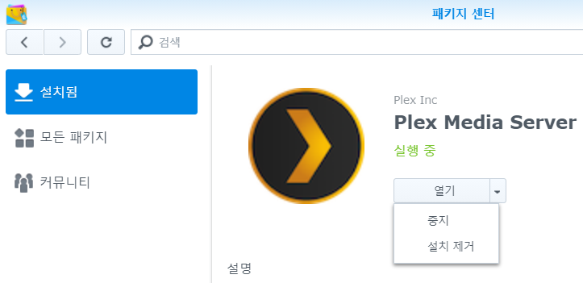
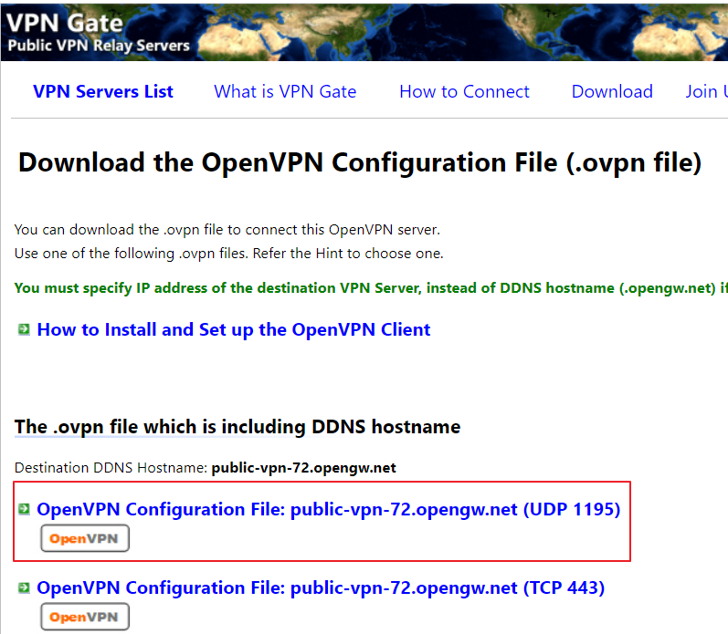

# redstar_javscraper

PLEX용 Japan Adule Video Metadata scraper입니다.
대부분의 사이트는 VPN 접속이 필요하며, VPN 접속되지 않은 경우
매칭 및 이미지를 받아올 수 없습니다.
현재 스크래핑 가능 사이트는 다음과 같습니다.

1. dmm.co.jp
2. r18.com
3. javbus.com
4. pornav.co
5. javdb.com
6. javlibrary.com

# 1. 설치방법
## A. 파일 복사
- PLEX Media Server\Plug-ins 경로에 redstar_javscraper.bundle 폴더로 복사 및 압축해제
    (Synology의 경우 /Plex/Library/Application Support/Plex Media Server/Plug-ins)
<center></center>

## B. Plex 재시작
- 패키지 센터 > PLEX Media Server에서 중지/시작합니다
<center></center>

## C. Agent 설정화면 이동

- PLEX로 들어가 화면 오른쪽 위 설정(공구 모양)을 눌러 설정으로 이동합니다.

- 좌측 메뉴의 설정 > 에이전트를 클릭해 '영화' 항목에 redstar_javscraper를 확인합니다.
<center></center>

## D. Agent 설정
- redstar_javscraper의 우측 톱니모양을 클릭해 에이전트 설정 화면으로 진입합니다.

- '파파고 한글번역 사용하기' 항목 체크(단, 한개 이상의 파파고 번역용 API KEY가 있어야 함)

     > 파파고 번역용 API Key는 콤마와 공백으로 분리하여 여러개 사용 가능(키 랜덤 사용)  
     (ex> QjNEe3wao0QrmdJJSB6X,C2CgwTsHaz Ffs0pgmtsyXmxmIogTw1,x24_41l4Mg....)

     > 파파고 번역용 API Key는 아이디당 10개씩 생성이 가능함(생성 방법은 네이버 검색 참조)

- 검색할 사이트 체크박스 선택
     > 미 체크된 사이트는 검색에서 제외됨
     > 검색은 체크된 모든 사이트를 순차적으로 검색하여 매치함

- 일치된 컨텐츠 검색사이트 정보를 '요약'에 추가: 미디어 파일이 최종 검색된 사이트를 확인하기 위해 요약 가장 앞단에 사이트명 추가

- 파일명에 아래의 문자열이 있으면 컨텐츠 등급에 '노모'로 표기 
     > 공백 구분자로 구분
     > 파일명에 해당 문자열이 있으면 컨텐츠 등급에 '노모'로 표기
     > 해당 문자열이 없으면 '유모'로 표기

- 응답타임아웃 시간지정: 각 컨텐츠 검색 및 이미지 다운로드의 응답 대기시긴 설정<br>
<font color='red'>※ VPN 사용시 응답시간 타임아웃을 300초 이상 설정할 것을 권고</font>

- Studio로 컬렉션 만들기: 검색된 미디어의 Studio로 컬렉션 생성

- Series로 컬렉션 만들기: 검색된 미디어의 Series로 컬렉션 생성


<center></center>
<center></center>
<center></center>

## E. 라이브러리 추가

- 관리 > 라이브러리에서 영화 항목으로 선택하여 라이브러리를 추가합니다.
<center></center>  
<center></center>  

- 폴더를 선택해 영상이 있는 폴더를 추가합니다.
<center></center>

- 고급을 선택해 '에이전트'를 redstar-javscraper로 선택하여 라이브러리를 추가합니다.
<center></center>

- 선택한 옵션을 순서로 검색하여 매칭되면 내용, 포스터, 백그라운드 이미지를 받아 PLEX에 적용합니다.
<center></center>

스크래핑이 되지 않는 품번이나 확인이 필요한 부분은
https://github.com/redstar-javscraper/redstar_javscraper 여기서 issue 탭에 등록해 주세요.
<br>
<br>

# 2. VPN 터널링 구축
※ PLEX가 시놀로지에 구축된 것을 전제로 작성합니다.
메타데이터를 검색하기 위한 사이트들은 대부분 warning으로 막혀 컨텐츠 또는 이미지를 불러올 수 없습니다. 이를 우회하여 다운받기 위해 다음과 같이 설정합니다. 

## 1. 무료 또는 유료 VPN계정 확보(OpenVPN)
- 보유중인 유료 VPN이 있다면 해당 계정을 통해, 그렇지 않다면 무료 VPN 정보를 확보합니다. 먼저, 무료 VPN정보를 다음 사이트에서 확인합니다. https://www.vpngate.net/en/
 <center></center>

- OpneVPN Config File을 클릭해 UDP 1195 설정파일을 받습니다. TCP 443포트를 이용하실 분은 아래 파일로 받아도 됩니다.
- 참고로, UDP 1195 포트에 대한 시놀로지 방화벽 해제 및 공유기 포트포워딩이 필요할 수 있습니다.
<center></center>

- 다운받은 파일에 다음의 규칙을 추가합니다.(중간 아무 라인에나 추가)
- 이 설정은 아래 주소로 접근할때만 VPN을 사용하도록 하는 설정으로 시놀로지가 토렌트 등 내부에서 인터넷에 접속할 때에는 인터넷을 직접 사용하고 아래 주소만 VPN을 사용하도록 하는 설정입니다.

```# Additional static routes
#route-nopull if use option, vpn_gateway
#dmm.co.jp
route 13.248.196.236 255.252.0.0 net_gateway
#r18.com
route 202.6.246.238 255.255.255.255 net_gateway
#javbus.com
route 104.25.112.111 255.240.0.0 net_gateway
#javdb.com
route 104.21.84.181 255.240.0.0 net_gateway
#javlibrary.com
route 104.21.41.117 255.240.0.0 net_gateway
#pornav.co
route 104.21.233.147 255.240.0.0 net_gateway
route 104.21.233.148 255.240.0.0 net_gateway
```

- 시놀로지에서 VPN 인터페이스를 추가합니다. 
제어판 > 네트워크 > 네트워크 인터페이스에서 '생성>VPN 프로파일생성'을 클릭합니다.
- OpenVPN을 선택하여 다음으로 넘어갑니다.
<center></center>

- 아래와 같이 프로파일 이름, 사용자명, 비밀번호 및 앞서 VPN설정파일을 선택합니다.(이름은 아무거나 가능, 사용자명과 비밀번호는 https://www.vpngate.net/en/ 첫화면에 표기합니다. 기본은 vpn / vpn 입니다)
<center></center>

- 추가된 VPN에서 우클릭 > 연결하면 VPN으로 연결이 수립됩니다.(약간 시간이 걸릴 수 있음)
<center></center>

- 이후 토렌트의 다운로드 속도가 잘 나오는지 확인한 후 docker LXqt(시놀로지 패키지 센터에서 검색됨)를 받아 실행하여 크롬 브라우저로 차단된 사이트가 잘 나오는지 확안하면 스크래핑이 정상적인지 알 수 있습니다.

# 3. 파일명 규칙
## 1. 품번은 하이픈(-)을 기준으로 구분함
## 2. xxx-999 형식으로 통일

 - 품번[추가정보1][추가정보2]제목.mp4
  ```ex.) OAE-101 [미카미유아] 올 누드 미카미유아.mp4
  ex.) FC2PPV-100000.mp4
  ex.) TOKYOHOT-1234.mp4
  ex.) CARIB-1000-222.mp4
```

 - 시리즈의 경우 Plex 기본 파일명 규칙과 동일
 - 이 경우 하나의 항목으로 묶이며 연속 재생됨(단, 바로 2번으로 갈 수 없음)
```cdX
discX
diskX
dvdX
partX
ptX
```
```
  ex.) SSNI-100.cd1.mp4, SSNI-100.cd2.mp4
```

### 권장 파일 관리방법
 - 아래 제시된 적절한 파일명으로 파일명 변경할 경우 매칭률이 상승함
 - 파일명과 동일한 표지 이미지가 있을 경우 해당 이미지를 타이틀 이미지로 설정함(한글 번역된 표지, 고화질 표지 등)
 - 자막파일은 동일 파일명.ko.mkv 형식으로 구성하는 것을 권고함
 - 참고로, 한글 표지 및 자막파일은 avjamak.com 사이트 등을 통해 확보(redstar_avjamakCroller 파일을 통해 쉽게 다운받을 수 있음. avjamak 팁 게시판 참조)

### 가장 적절한 파일명 예시 <font color=blue>( 품번 [배우명][노모/유모] 제목.mp4 )</font>
- MIRD-130 [시노다 유 외 총 9명][SD] 바코바코 버스투어 2014.avi
- OFJE-170 [미카미 유아 등 총 19명] S급 사람과 초고급 남성 에스테틱 살롱 8시간[720p].mp4
- ABP-536 [와카나 나오][노모 유출] 나를 좋아한 나만의 고분고분한 애완 동물.mp4
- ABP-893 [스즈무라 아이리][노모 유출] 밀착 다큐멘터리 FILE.01 약 1개월에 걸친 완전 밀착 논픽션!.mp4

### 분류가능 예시 
- IPX-999
- IPX 158 => 공백으로 구분 가능
- IPX-158레이블 설명글 => 품번 이후 설명글 가능
- IPX-158 [배우명] 레이블 설명글 => 대괄호는 생략됨
- IPX-158 [배우명] [레이블 설명글]
- 302GERK-295abcdefg
- FC2PPV-1035965
- HEYZO-1365
- Caribbeancom-112117-004 => carib의 메인-서브품번 가능
- CARIB-011814-525
- 1pondo-112812-481
- TokyoHot-n1287 
- hhd800.com@MIDV-011 => 자동으로 hhd800.com 제외 후 검색

### 분류 불가능 예시
- Tokyo-Hot-n1287 => 불가능. TokyoHot로 붙여서 명명해야 함
- 0022223 => 불가능. 숫자만 들어간 품번 검색 불가

# ※ 변경사항
2022.01.12
 - dmm 스튜디오 항목에 불필요한 문자열 제거
 - javbus 배경이미지 다운되지 않는 버그 제거
 - javbus 일자 정보 가져오지 못하는 버그 제거

2022.01.11
 - dmm.co.jp 검색 방식 변경
 - 이제 이전보다 더 많은 줄거리 정보를 가져옴
 - 매칭률이 향상됨
 - 배우 정보가 없을 경우 avdbs의 정보를 가져옴
 - r18.com 개별 호출이 API로 변경됨에 따라 모든 코드를 재 수정함
 - javbus 컨텐츠 업데이트에 따라 모든 코드 재 수정함
 - pornav 일부 컨텐츠 인식방식 변경에 따른 매칭률 향상 및 코드 재 수정
 - javdb 성인 인증 우회하여 매칭률 향상 및 코드 재 수정
 - javlibrary 전체 코드 재 수정

2021.06.29
- javdb.com 사이트 성인인증 추가 후 SSL Handshake 오류 발생. 사이트 제거

2021.06.10
- DMM 검색 실패 수정 -> 성인 확인 페이지 우회 코드가 header에서 cookie로 변경되었음
- javlibrary.com 검색사이트 추가

2020.12.26
- DMM 검색 실패 수정 -> 성인 확인 페이지 우회

2020.11.03
- 파일명을 타이틀로 사용 시 제목 앞에 ▶ 표시를 합니다. 이 표시가 있는 항목은 재 업데이트시에도 제목행이 변경되지 않습니다. 변경을 원하실 경우 표시를 제거 저장 및 자물쇠를 푼 상태로 저장하세요

2020.11.02
 - 파일명에 타이틀 있을 경우 Plex타이틀로 사용하는 옵션 사용시 정상적으로 추가되지 않는 문제 수정
 - dmm 검색 시 타이틀명이 검색 타이틀을 가져와 전체 타이틀이 잘리는 문제 

2020.10.29
 - DV 시작 품번 조회 실패 수정(이전 조회 실패한 항목은 '일치항목 수정' 에서 정상 품번으로 재 조회(dv-1234형식)
 - javdb.com 추가(배경 이미지 다운로드시 -1)
 - FC, TOKYO, CARIB 검색 시 javdb, pornav만 검색되도록 제한하여 속도 증가
 - FC, TOKYO, CARIB 검색 시 품번만 검색되도록 변경하여 매칭률 상승
 - 파일명에 제목(타이틀)이 있을 경우 이를 Plex 타이틀로 사용하는 옵션 추가(파일명 타이틀 사용 시 번역하지 않음)
 - 로그레벨 설정 옵션 추가(Error, Info, Debug 레벨 설정 가능)

2020.10.27
 - DV 시작 품번 조회 실패 수정(이전 조회 실패한 항목은 '일치항목 수정' 에서 정상 품번으로 재 조회(dv-1234형식)
 - javdb.com 추가(배경 이미지 다운로드시 -1)
 - FC, TOKYO, CARIB 검색 시 javdb, pornav만 검색되도록 제한하여 속도 증가
 - FC, TOKYO, CARIB 검색 시 품번만 검색되도록 변경하여 매칭률 상승

2020.10.25
 - 한번 검색된 라이브러리를 재 검색할 때 검색되지 않는 문제 수정
 - 한번 검색된 라이브러리를 재 검색할 때 기 등록된 장르 항목들이 사라지지 않는 문제 수정
 - 파일명에 'UNC, 노모' 발견 시 컨텐츠 등급에 '노모' 표기 옵션 추가(미 발견시 유모로 표기되며) 한번 매칭된 이후 업데이트시에는 확인하지 않음(글자 입력 방식에서 선택으로 변경함. Agent에서 한글 입력 시 오류)

2020.10.21
 - pornav 사이트 추가(FC2, Tokyohot 등 검색 가능)

2020.10.17
 - 각 사이트별 접속횟수 감소
 - search 이후 update시 search에서 검색된 사이트 바로 검색
 - dmm, javbus 사이트 검색시 시놀로지 nas에서 검색되지 않는 문제점: 
   https://nonaka.tistory.com/53 이 사이트를 참조하여 synology 네트워크 인터페이스를 추가하여
   해외 VPN서버를 이용하면 이미지 다운로드 및 검색이 잘 됨(단, 이후 라우팅 테이블을 작성해 해당 사이트 호출시에만 VPN접속하도록 수정 필요)

2020.10.16
 - search시 id값에 사이트명 등 구분자로 입력하는 항목 제거(재 검색 시 기존 사이트로만 검색되는 문제 해결)
 - dmm, javbus 사이트 검색 시 시놀로지 기준 nas에서 해당 사이트가 차단되어 이미지를 가져오지 못하는 문제 발견(해결 중)
